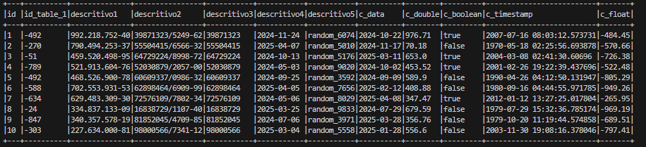

### Documentação das Configurações de Campos

Esta documentação descreve as configurações utilizadas nos campos para gerar dados sintéticos. As configurações especificam como os valores dos campos são gerados, formatados ou derivados de outros campos.

#### Parâmetros de Configuração

##### is_sequencial
- **Descrição**: Define se o campo deve ser gerado sequencialmente.
- **Valores Possíveis**: `True`, `False`.
- **Exemplo**:
  ```json
  "Campo": {
      "is_sequencial": "True"
  }
  ```

##### is_numeric
- **Descrição**: Indica se o campo deve conter valores numéricos.
- **Valores Possíveis**: `True`, `False`.
- **Exemplo**:
  ```json
  "Campo": {
      "is_numeric": "True",
      "type": "bigint",
      "is_negative_number": "True"
  }
  ```

##### is_negative_number
- **Descrição**: Define se os números gerados devem ser negativos.
- **Dependência**: Funciona apenas se `is_numeric` for `True`.
- **Valores Possíveis**: `True`, `False`.
- **Exemplo**:
  ```json
  "Campo": {
      "is_numeric": "True",
      "type": "bigint",
      "is_negative_number": "True"
  }
  ```

##### type
- **Descrição**: Especifica o tipo de dados numéricos a ser gerado.
- **Valores Possíveis**: `bigint`, `double`, `float`.
- **Exemplo**:
  ```json
  "Campo": {
      "is_numeric": "True",
      "type": "double",
      "round": 2
  }
  ```

##### round
- **Descrição**: Define o número de casas decimais para valores numéricos do tipo `double` ou `float`.
- **Dependência**: Funciona apenas se `type` for `double` ou `float`.
- **Valores Possíveis**: Qualquer inteiro.
- **Exemplo**:
  ```json
  "Campo": {
      "is_numeric": "True",
      "type": "double",
      "round": 2
  }
  ```

##### format
- **Descrição**: Define um formato específico para o valor gerado.
- **Exemplo**:
  ```json
  "Campo": {
      "format": "###.###.###-##"
  }
  ```

##### is_derived
- **Descrição**: Define se o campo é derivado de outro campo.
- **Dependência**: Requer os parâmetros `derived_field` e `derived_size`.
- **Valores Possíveis**: `True`, `False`.
- **Exemplo**:
  ```json
  "Campo": {
      "is_derived": "True",
      "derived_field": "descritivo2",
      "derived_size": 8
  }
  ```

##### derived_field
- **Descrição**: Nome do campo do qual o valor é derivado.
- **Exemplo**:
  ```json
  "Campo": {
      "is_derived": "True",
      "derived_field": "descritivo2",
      "derived_size": 8
  }
  ```

##### derived_size
- **Descrição**: Define o tamanho do valor derivado do campo especificado em `derived_field`.
- **Exemplo**:
  ```json
  "Campo": {
      "is_derived": "True",
      "derived_field": "descritivo2",
      "derived_size": 8
  }
  ```

##### choise
- **Descrição**: Define uma lista de opções para valores que serão gerados.
- **Exemplo**:
  ```json
  "Campo": {
      "choise": ["A", "B", "C"]
  }
  ```

##### default
- **Descrição**: Define um valor padrão para o campo.
- **Exemplo**:
  ```json
  "Campo": {
      "default": "default_value"
  }
  ```
#### Exemplo de Output 


